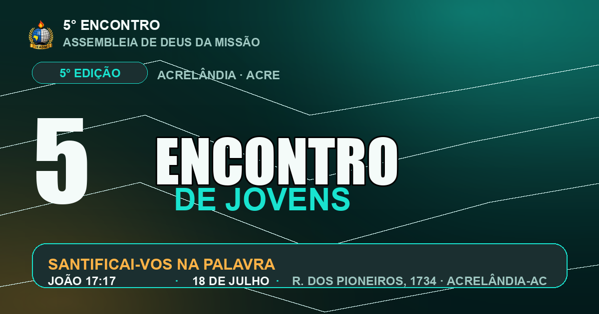

# 🔥 5° Encontro de Jovens — IEADM Acrelândia/AC

<div align="center">



[](https://mrjohnpaixao.github.io/4-Encontro_de_Jovens/)
[](https://mrjohnpaixao.github.io/4-Encontro_de_Jovens/#tema)

</div>

---

## ✦ Sobre o evento

> *"Santifica-os na verdade; a tua palavra é a verdade."*
> — **João 17:17**

**Data:** Sexta, 18 de Julho  
**Local:** Assembleia de Deus da Missão — Rua dos Pioneiros, 1734, Centro  
**Cidade:** Acrelândia — Acre

---

## 👥 Ministração

| Papel | Nome | Cidade |
|-------|------|--------|
| 🎤 Preletor | James Paiva | Assis Brasil — AC |
| 🎵 Cantor | Samuel Barboza | — |

## 🏛 Liderança

| Cargo | Nome |
|-------|------|
| Pastor Presidente | Pr. Mizael Montes |
| Missionária | Miss. Eliana Torres |
| Líderes de Jovens | Hitalo & Elaine |
| Líderes de Jovens | Maciel & Sauriane |

---

## 🛠 Tecnologias

- HTML5 + CSS3 vanilla (sem frameworks)
- React 18 + Babel (painel de Tweaks)
- Fontes: Anton · Kaushan Script · Space Grotesk (Google Fonts)
- Animações: CSS `@keyframes`, `IntersectionObserver`, parallax

## 📁 Estrutura

```
├── index.html              # Página principal (GitHub Pages)
├── styles.css              # Tokens, fontes, sistema de energia/glow
├── sections.css            # Estilos por seção
├── app.jsx                 # Painel de Tweaks (React)
├── tweaks-panel.jsx        # Shell do painel de Tweaks
└── assets/
    ├── cantor-samuel.png
    ├── preletor-james.png
    ├── lideres-1.png
    ├── lideres-2.png
    ├── pastor-misael-eliana.png
    ├── tema-santificai.jpeg
    ├── logo-ieadm.png
    ├── favicon.svg
    └── og-image.png
```

## 🚀 GitHub Pages

O site é servido automaticamente via **GitHub Pages** a partir da branch `main`.

Para ativar: `Settings → Pages → Source: main / root`

---

<div align="center">

**IEADM · Assembleia de Deus da Missão**  
*Adoradores por Excelência*  
Acrelândia — Acre — Brasil

</div>
